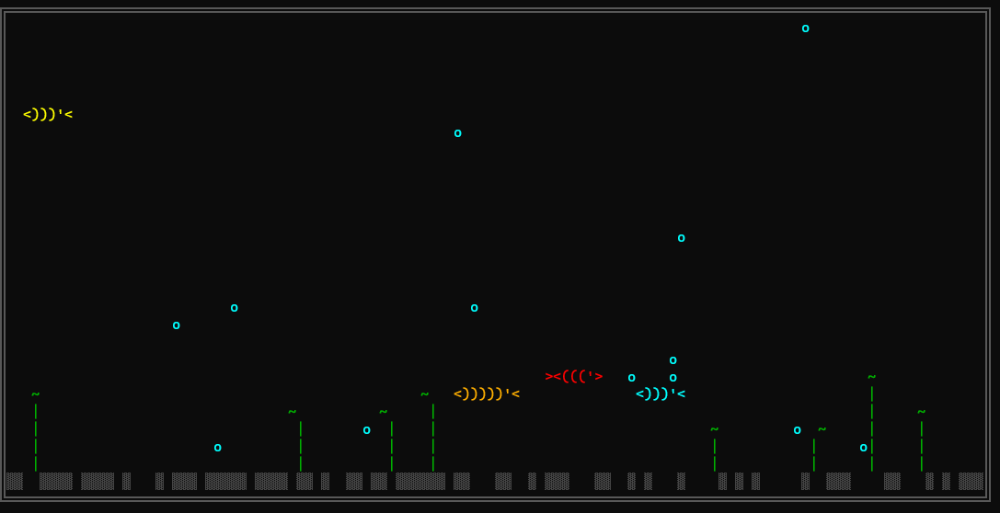

# Terminal Fish Tank



An interactive fish-feeding game in your cmd / Windows Terminal. Pure Python stdlib, zero dependencies.

## Run

```
python fish.py
```

## Controls

- `SPACE` drop food
- `P` pause
- `Q` / `ESC` quit

## Gameplay

Fish actively chase food. Each pellet eaten scores 1 point. Four AI fish of different colors and sizes swim on their own; bubbles rise, seaweed sways, and gravel lines the bottom.

> When running in cmd.exe, make sure the window is at least 30x12.
